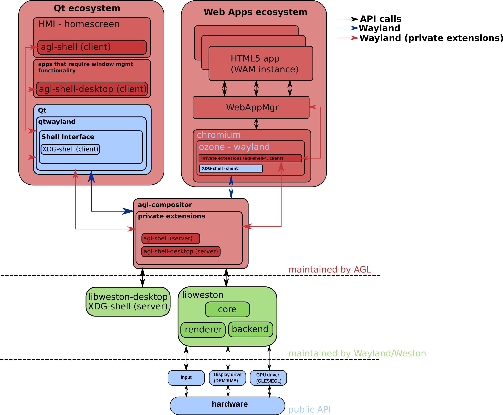

# agl-compositor

## Design and overall architecture

The compositor is built on top of libweston and on libweston-desktop. The
latter, among other things, is required as it provides the server side
implementation of the XDG shell protocol which underlying toolkits
(like qtwayland/chromium) make use to deliver desktop like functionality.
The former is used to provide back-ends and rendering support, besides
implementing the wayland protocol.

xdg-shell is currently de facto protocol for handling all window management
related functionality. In order to avoid polluting the wayland protocol
namespace, the XDG extension, together with some other useful protocols, like
the linux-dmabuf one, are all developed under the wayland-protocols umbrella.

The whole purpose of wayland-protocols is to enhance the Wayland protocol with
new functionality and bring new extensions entirely. Compositors are free to
implement, modify, enhance, and add new extensions to wayland-protocols but
they need to do so in consensus.

Besides the core wayland protocol and extended functionality from
wayland-protocols, a compositor can provide additional protocol extension
specifications (obviously specific to that compositor). agl-compositor uses
private extensions to deliver specific functionality or improve the current
functionality to align with AGL demands. See [protocol extension](#protocol-extensions)
about them.

Traditionally, clients were entirely separated from the window manager, the
desktop environment and the server. In wayland all these are conceptually under
the same entity though they are implemented as different UNIX processes, or a
different namespace with front and back-end APIs, exposed by different
libraries.  As such, the compositor and the shell driving the UI should be seen
as one and the same, and in practice, this happens on traditional desktop
environments.

agl-compositor has logic in place to spawn/run the shell, but in case of AGL,
the shell can be represented under different forms, as well as the fact that
the process management has another layer baked in to handle MAC (Mandatory
Access Control) labels and use a custom application framework
management. These are all tightly integrated and therefore, the agl-compositor
will not automatically start the shell client, although there's code to handle
that.

## Customizing and tailoring the compositor

The compositor only adds basic functionality, and depending on use-cases, one
might want to further enhance or tailor the compositor to fit their need.  The
compositor only contains the bare minimum, necessary bits to bring up the
screen and make use of private extensions to integrate better with the existing
AGL infrastructure. It is encouraged and desirable to modify the compositor if
more customization is required.

## Protocol extensions

Compositors can define and implement custom extensions to further control
application behaviour. For AGL, respectively, for agl-compositor, we have two
private extensions defined. One targeted at defining surface roles commonly
found desktop environments (like panels, and backgrounds), which acts as the
shell client, and one targeted at regular application(s) that might require
additional functionality.

This document describes the overall functionality and some implementation
details and potential corner-cases. Refer to the protocol XML specification for
further and up-to-date documentation.

### Surface roles

Internally, agl-compositor assigns to regular XDG applications, a default,
desktop role. Further roles like a background or a panel, are available to
further customize layer and orientation of surfaces.

These have **no** particular meaning, except that it hints the compositor where
they should be stacked or where to position them. The background one occupies
the most lower layer, the desktop ones on top and the panel surfaces the upper
most layer.

Additional roles have been added, in a different extension, to add further
functionality with the control/security functions being transferred over to a
policy framework in case that is necessary. See [policy api][#policy] for
further details.

### agl-shell

Clients can make use of this protocol to define different kind of roles for
different kind of surfaces. This defines panels and a background surface.  It
includes to ability to activate other applications, assuming that those are
already running. Activation happens by using using the app_id, respectively
using set_app_id request as defined by the XDG shell protocol. Established
client-side implementation of the XDG shell protocol will have a function used
to set it up, or it should provide or expose an API to do so.

Clients will be **required** to set their application ids accordingly in order
for the client shell to activate them.

### agl-shell-desktop

This extension is targeted at keeping some of the functionally already
established in AGL a) to allow applications display/activate other
surfaces/application window, and b) to set further roles, specially dialog
pop-ups and split-type of surfaces.

Clients can make use of this protocol to set further roles, like independently
positioned pop-up dialog windows, split type of surfaces or fullscreen ones.
Additional roles can be added by extending the protocol. These roles serve as
hints for the compositor and should be used before the actual surface creation
takes place such that the compositor can take the necessary steps to ensure
those requirements.

#### Additional surface roles

Like mentioned earlier, the compositor is already making use of some (internal)
roles, and with this extension we add some further roles. These are: split
(there's vertical and a horizontal one), fullscreen, and pop-up one. Internally
these are encoded with different values such that there's a translation needed,
between the protocol values and the internal values.

Besides the roles, additional data can to be passed, but only relevant
depending on the role.

#### Receiving application state events from (other) applications

agl-shell-desktop exposes two events which client can install handlers for, one
that signals when regular XDG application have been created, and one that
signals state changes (active/hidden) as well as destroyed/no longer present
surfaces. These events can be useful to add additional functionality if
needed.

### Activating (other) applications

Both agl-shell and agl-shell-desktop have requests to activate other
application based on their XDG shell app_id. In case the application is
present/running it it will attempt to make the surface backing that application
the current activate one, with each output having independently active
surfaces.

### Explicit output

The activation and setting surface roles requires passing an output
(wl_output).  The output is the wayland interface representation of an output
and is **mandatory**.  Clients can retrieve it (the output) if they wish to
place the surface on other outputs by using the toolkits exposing wayland
objects.  A human-like representation is provided by binding directly, by using
other extension implemented by the client (i.e., xdg_output is the one
recommended) or by using abstraction implementation written on top.

### Protocol design, future work and potential improvements

Both protocols assume immediate, synchronous behaviour and to some extent lack
some error handling functionality.

Role assignment to surfaces could probably be improved with an additional
interface with can add further data, if that roles assumes that to be true.

There seems to be some overlapping functionality with respect to activating
applications, so a potential improvement would be that the agl-shell protocol
only contains the ability to set shell related surface roles, and
agl-shell-desktop to be used when needing to activate applications.
For the client shell this means that it will need to bind to both of the
extensions, one that set-ups the background and panel roles, with the other
needed to activate applications.

## Policy

The compositor contains an API useful for defining policy rules.  It contains
the bare minimum and installs, by default, an allow-all kind of engine. A
deny-all policy engine exists and can be switched to by using
`-Dpolicy-default=deny-all` build time option.

For instance, in order to configure the compositor with that policy one could
issue:

	$ meson -Dprefix=/path/to/where/to/install/compositor -Dpolicy-default=deny-all build_directory

Users wanting  to create their own policy engine should create a specialized
version and use `struct ivi_policy_api` where they can install their own
callbacks.

The default policy found in src/policy-default.c should more than sufficient to
get started. Users can either re-puporse the default policy or create a new one
entirely different, based on their needs.

### Hooks

These are hooks for allowing the creation, committing and activation of surfaces
(`ivi_policy_api::surface_create()`, `ivi_policy_api::surface_commited()`,
 `ivi_policy_api::surface_activate()`).

Another hook, `ivi_policy_api::policy_rule_allow_to_add()` can be used to
control if policy rules (the next type) can be added or not. Finally, we have
`ivi_policy_api::policy_rule_try_event()` which is executed for each policy
rules currently added, by using the policy API `ivi_policy_add()`.

Users can customize the hooks by using some sort of database to retrieve the
application name to compare against, or incorporate some kind of policy rule
engine.  Alternatively, one can use the deny-all policy engine which allows the
top panel applications to be used/displayed as permitted applications.

### Policy rules

Policy (injection) rules can be added using the policy API framework.  The
protocol allows to define policy rules that should be executed by using the
`ivi_policy_api::policy_rule_try_event()` callback. These are particularly useful
when handling state changes. The framework API allows adding new states and
events and the default implementation has code for handling events like showing
or hiding the application specified in the policy rule.

#### Default events and states

By default the when creating the policy framework it will add the 'show', and
'hide' events and the 'start', 'stop' and 'reverse' states. An special type,
assigned by default is 'invalid'.

#### State changes

A state change has to be propaged from to the compositor, by using
`ivi_policy_state_change()`, to signal the compositor the (state) change itself,
in order to apply the policy rules, and implicitly to call the event
handler `ivi_policy_api::policy_rule_try_event()`.
